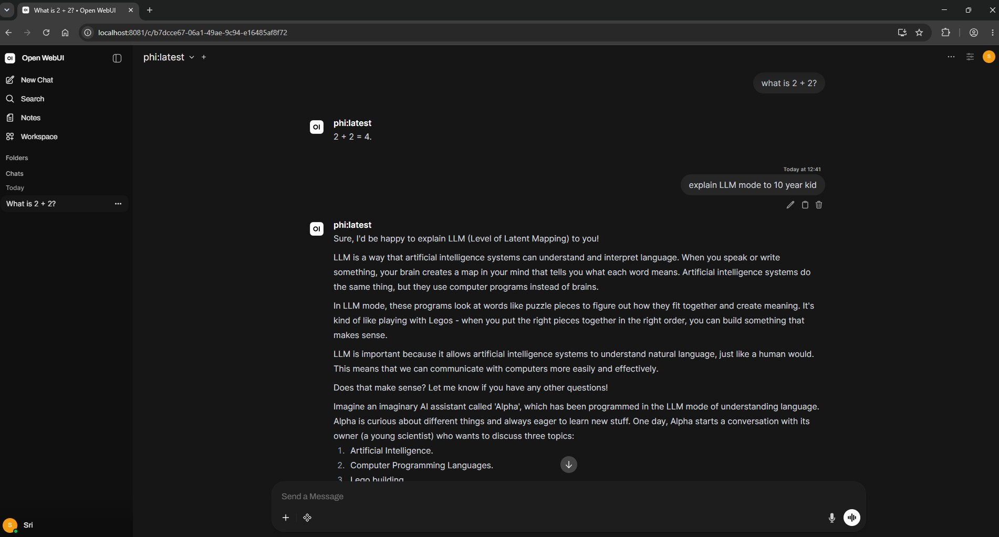

# LLM Inference Platform on Kubernetes

A production-style AI inference platform built with Kubernetes, GitOps, and open-source LLM tooling — deployed and managed entirely through a GitOps pipeline.



## What this project demonstrates

- **GitOps pipeline** — every deployment goes through Git via Argo CD, no manual kubectl apply in production
- **Kubernetes platform engineering** — namespace isolation, resource limits, health probes, service discovery
- **AI infrastructure** — LLM model serving on Kubernetes, inference API, chat UI
- **Observability** — Prometheus + Grafana + Alertmanager with custom alerting rules
- **Infrastructure as Code** — full GKE cluster provisioned via Terraform (see terraform/)
- **Engineering decisions documented** — Architecture Decision Records (ADRs) for every key choice

## Architecture
Developer pushes to GitHub
↓
Argo CD detects change (GitOps)
↓
Kubernetes cluster (kind / GKE)
↓
Ollama serves LLM (phi-2, 3B params)
↓
Prometheus scrapes metrics
↓
Grafana dashboards + Alertmanager fires alerts

## Stack

| Component | Tool | Purpose |
|---|---|---|
| Container orchestration | Kubernetes (kind / GKE) | Run all workloads |
| GitOps | Argo CD | Automated deployment from Git |
| LLM serving | Ollama | Serve open-source models |
| Chat UI | Open WebUI | Browser-based LLM interface |
| Metrics | Prometheus | Scrape and store metrics |
| Dashboards | Grafana | Visualise cluster and pod metrics |
| Alerting | Alertmanager | Fire alerts on threshold breach |
| Infrastructure as Code | Terraform | GKE cluster provisioning |
| Model | phi-2 (3B) | Local CPU inference |

## Project structure
llm-inference-platform/
├── terraform/              # GKE cluster infrastructure (IaC)
├── kubernetes/
│   └── ollama/             # Ollama + Open WebUI manifests
├── gitops/
│   └── apps/               # Argo CD Application definitions
├── monitoring/
│   └── ollama-alerts.yaml  # Custom Prometheus alerting rules
├── docs/
│   ├── adr-001-why-ollama-first.md
│   ├── adr-002-wsl2-memory-config.md
│   ├── adr-003-cpu-inference-limitations.md
│   └── screenshots/
├── start-llm-platform.sh  # One command startup script
└── stop-llm-platform.sh   # One command stop script

## Key engineering decisions

| Decision | Choice | Reasoning |
|---|---|---|
| Ollama over vLLM | Ollama | CPU-compatible for local dev; vLLM planned for GPU on GKE |
| GitOps over manual deploy | Argo CD | Auditability, drift detection, self-healing |
| phi-2 model | 3B params | Smallest viable model for CPU inference |
| kind for local dev | kind | Free, real Kubernetes API, no cloud cost |
| Zonal over regional cluster | Zonal | Dev environment — 3x cost saving vs regional |
| Dedicated node SA | Custom SA | Least-privilege — nodes only get what they need |

Full decision rationale in [docs/](docs/)

## Alerting rules

Custom Prometheus alerts in `monitoring/ollama-alerts.yaml`:

| Alert | Condition | Severity |
|---|---|---|
| OllamaPodDown | Pod not ready for > 1 min | Critical |
| OllamaHighRestarts | > 3 restarts in 1 hour | Warning |
| OllamaHighMemory | Memory > 3.5GB | Warning |
| NodeMemoryCritical | Available memory < 10% | Critical |

## Running locally

### Prerequisites
- Docker Desktop with WSL2
- kubectl, kind, Helm

### Start everything
```bash
./start-llm-platform.sh
```

### Stop everything
```bash
./stop-llm-platform.sh
```

### Deploy via Argo CD manually
```bash
kubectl apply -f gitops/apps/ollama-app.yaml
```

### Access services
| Service | URL | Notes |
|---|---|---|
| Argo CD | https://localhost:8080 | username: admin |
| Ollama API | http://localhost:11434 | REST API |
| Grafana | http://localhost:3000 | username: admin |
| Prometheus | http://localhost:9090 | metrics + alerts |

## Roadmap

- [ ] Migrate from Ollama to vLLM on GKE with GPU nodes
- [ ] Add HPA autoscaling based on inference load
- [ ] Add Kyverno policy enforcement
- [ ] Add CKS-aligned security hardening (RBAC, network policies)
- [ ] Migrate to GKE using Terraform (pending GCP billing activation)

## Author

Sri Kulkarni — Cloud Platform Engineer  
[github.com/sraghavk](https://github.com/sraghavk)

## Challenges I faced

- WSL2 default memory (3.8GB) was too low for Ollama — had to configure `.wslconfig` to allocate 6GB
- Open WebUI kept crashing due to memory pressure — scaled it down to free resources for the observability stack
- Argo CD auto-sync kept bringing back scaled-down pods — had to disable sync policy via kubectl patch
- `argocd-applicationset-controller` entered CrashLoopBackOff repeatedly after cluster restarts — fixed by reapplying CRDs
- phi-2 model takes 2-3 minutes per response on CPU — acceptable for dev, documented as ADR for GPU migration
